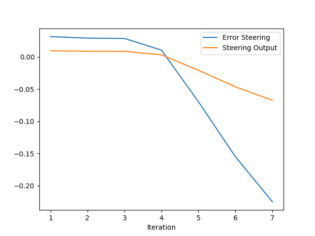
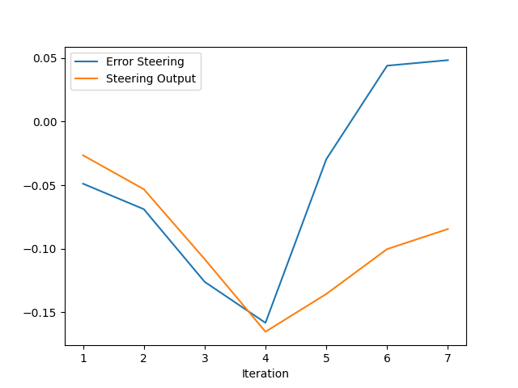
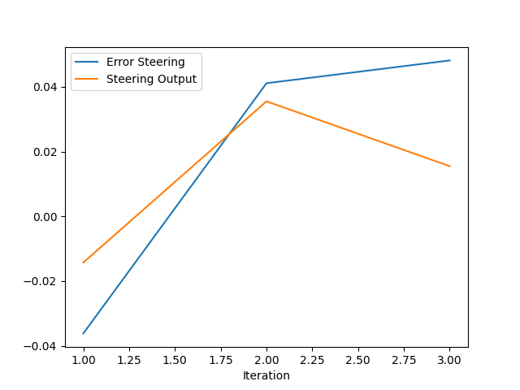
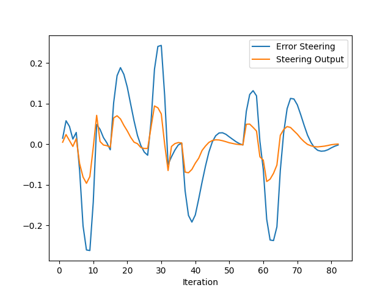
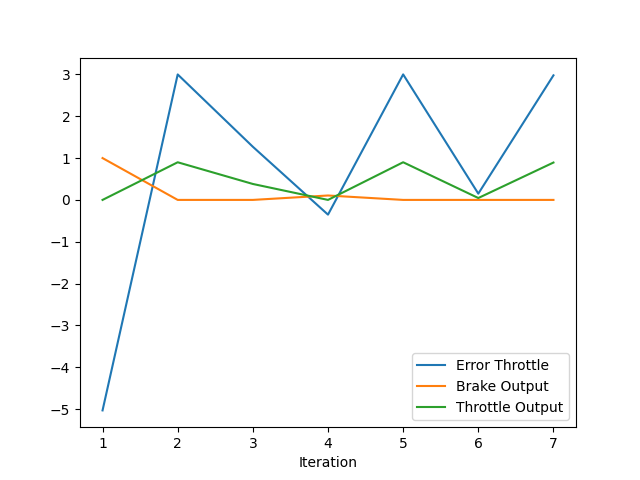
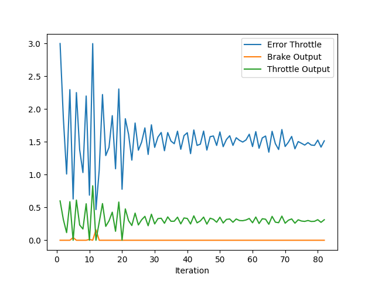
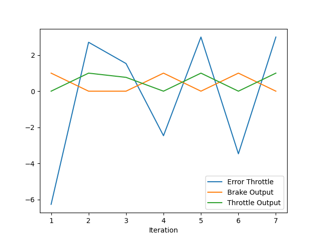
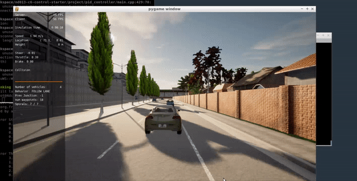

# Control and Trajectory Tracking for Autonomous Vehicle

# Proportional-Integral-Derivative (PID)

In this project, you will apply the skills you have acquired in this course to design a PID controller to perform vehicle trajectory tracking. Given a trajectory as an array of locations, and a simulation environment, you will design and code a PID controller and test its efficiency on the CARLA simulator used in the industry.

### Installation

Run the following commands to install the starter code in the Udacity Workspace:

Clone the <a href="https://github.com/udacity/nd013-c6-control-starter/tree/master" target="_blank">repository</a>:

`git clone https://github.com/udacity/nd013-c6-control-starter.git`

## Run Carla Simulator

Open new window

* `su - student`
// Will say permission denied, ignore and continue
* `cd /opt/carla-simulator/`
* `SDL_VIDEODRIVER=offscreen ./CarlaUE4.sh -opengl`

## Compile and Run the Controller

Open new window

* `cd nd013-c6-control-starter/project`
* `./install-ubuntu.sh`
* `cd pid_controller/`
* `rm -rf rpclib`
* `git clone https://github.com/rpclib/rpclib.git`
* `cmake .`
* `make` (This last command compiles your c++ code, run it after every change in your code)

## Testing

To test your installation run the following commands.

* `cd nd013-c6-control-starter/project`
* `./run_main_pid.sh`
This will silently fail `ctrl + C` to stop
* `./run_main_pid.sh` (again)
Go to desktop mode to see CARLA

If error bind is already in use, or address already being used

* `ps -aux | grep carla`
* `kill id`


## Project Instructions

In the previous project you built a path planner for the autonomous vehicle. Now you will build the steer and throttle controller so that the car follows the trajectory.

You will design and run the a PID controller as described in the previous course.

In the directory [/pid_controller](https://github.com/udacity/nd013-c6-control-starter/tree/mathilde/project_c6/project/pid_controller)  you will find the files [pid.cpp](https://github.com/udacity/nd013-c6-control-starter/tree/mathilde/project_c6/project/pid_controller/pid.cpp)  and [pid.h](https://github.com/udacity/nd013-c6-control-starter/tree/mathilde/project_c6/project/pid_controller/pid.h). This is where you will code your pid controller.
The function pid is called in [main.cpp](https://github.com/udacity/nd013-c6-control-starter/tree/mathilde/project_c6/project/pid_controller/main.cpp).

### Step 1: Build the PID controller object
Complete the TODO in the [pid_controller.h](https://github.com/udacity/nd013-c6-control-starter/tree/mathilde/project_c6/project/pid_controller/pid_controller.h) and [pid_controller.cpp](https://github.com/udacity/nd013-c6-control-starter/tree/mathilde/project_c6/project/pid_controller/pid_controller.cpp).

Run the simulator and see in the desktop mode the car in the CARLA simulator. Take a screenshot and add it to your report. The car should not move in the simulation.

## Results


### Step 2: PID controller for throttle:
1) In [main.cpp](https://github.com/udacity/nd013-c6-control-starter/tree/mathilde/project_c6/project/pid_controller/main.cpp), complete the TODO (step 2) to compute the error for the throttle pid. The error is the speed difference between the actual speed and the desired speed.

Useful variables:
- The last point of **v_points** vector contains the velocity computed by the path planner.
- **velocity** contains the actual velocity.
- The output of the controller should be inside [-1, 1].

2) Comment your code to explain why did you computed the error this way.

3) Tune the parameters of the pid until you get satisfying results (a perfect trajectory is not expected).

### Step 3: PID controller for steer:
1) In [main.cpp](https://github.com/udacity/nd013-c6-control-starter/tree/mathilde/project_c6/project/pid_controller/main.cpp), complete the TODO (step 3) to compute the error for the steer pid. The error is the angle difference between the actual steer and the desired steer to reach the planned position.

Useful variables:
- The variable **y_points** and **x_point** gives the desired trajectory planned by the path_planner.
- **yaw** gives the actual rotational angle of the car.
- The output of the controller should be inside [-1.2, 1.2].
- If needed, the position of the car is stored in the variables **x_position**, **y_position** and **z_position**

2) Comment your code to explain why did you computed the error this way.

3) Tune the parameters of the pid until you get satisfying results (a perfect trajectory is not expected).

### Step 4: Evaluate the PID efficiency
The values of the error and the pid command are saved in thottle_data.txt and steer_data.txt.
Plot the saved values using the command (in nd013-c6-control-refresh/project):

```
python3 plot_pid.py
```

You might need to install a few additional python modules: 

```
pip3 install pandas
pip3 install matplotlib
```

## Results

In total, we had to fine-tune 6 parameters (3 for pid_steer, 3 for pid_throttle), which is very inefficient to tune manually (we could have 2^6 combinations). I have attempted to implement the Twiddle algorithm (in PID::Twiddle) but it had many compilation errors in addition to the fact that the code in Sebastian's lecture had to be in an outer loop (different from the code structure in main.cpp). For that reason I had opted to fine-tune it manually.

First, I tried to see the effect of each of P without I and D, and P with I, and P with D, for the steering and throttle, to observe the vehicle behavior based on each of them.

Using P_steering = 0.3 , I_steering = 0, D_steering = 0:


It seems that the proportional part lead the vehicle to drift away aggressively.

Using P_steering = 0.3, I_steering = 0.3, D_steering = 0:


It seems that we need the integral part in our fine-tuning, but with much less values.

Using P_steering = 0.3, I_steering = 0, D_steering = 0.3:


The derivative component helps the steering to move smoothly, but we still need the integral component.


Using P_steering = 0.3, I_steering = 0.001, D_steering = 0.3:



Although the throttle error largerly depends on the steering error, I plot below the different tuning stages of the throttle PID controller.

Using P_throttle = 0.3, I_throttle = 0, D_throttle = 0:


Using P_throttle = 0.2, I_throttle = 0, D_throttle = 0.1:


At that point it seemed that the throttle wasn't responsiple for the bad behavior of the vehicle, and extra tuning of the steering is needed.
Also, It was obvious that the integral part of the throttle wasn't needed, in addition to the differential part, but the proportional part needed a littile bit of tuning to allow a smooth driving.

Using P_throttle = 0.5, I_throttle = 0, D_throttle = 0:



The final vehicle behavior of the PID controller:


Answer the following questions:
- Add the plots to your report and explain them (describe what you see)
+ Added above.

- What is the effect of the PID according to the plots, how each part of the PID affects the control command?
+ From the experimental fine-tuning done above, it seemed that the integral and derivative component wasnot needed in the PID_throttle, however, both are needed for the PID_steering.

- How would you design a way to automatically tune the PID parameters?
+ I attempted to implement the Twiddle algorithm (PID::Twiddle) but it resulted into many compilations error, so I opted to manually fine-tuning (which is very ineffective)

- PID controller is a model free controller, i.e. it does not use a model of the car. Could you explain the pros and cons of this type of controller?
- Very inefficient when having to balance the PID components according to the motion behavior (instead of waiting a feedback from the sensors)
+ Easily implemented and fine-tuned

- (Optional) What would you do to improve the PID controller?
+ Implement Twiddle algorithm and use a bicycle motion model for extra fine-tuning.


### Tips:

- When you wil be testing your c++ code, restart the Carla simulator to remove the former car from the simulation.
- If the simulation freezes on the desktop mode but is still running on the terminal, close the desktop and restart it.
- When you will be tuning the PID parameters, try between those values:

